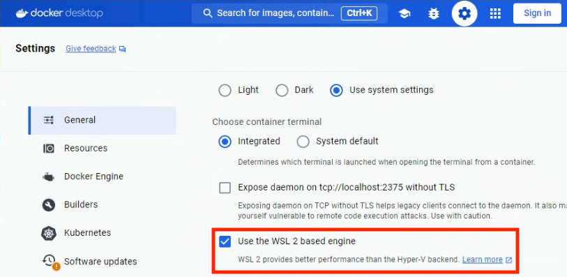

# Development Environment

## Overview

The **eXeLearning Web** project uses Docker to provide a consistent and easy-to-configure development environment. It includes:

* **Web Server**: Container with PHP-FPM, Nginx, and Mercure for real-time features
* **Database**: SQLite by default (also supports MariaDB/MySQL and PostgreSQL)

A **Makefile** is also provided with commonly used development commands.

## Prerequisites

* **Docker** (or Docker Desktop)
* Recommended operating systems:

  * Linux (Ubuntu, Mint, Fedora)
  * macOS
  * Windows with WSL enabled ([More info on WSL with Docker](https://docs.docker.com/desktop/wsl/))

## Quick Installation

In most cases, you only need to run the following commands:

```bash
# 1. Clone the repository
git clone https://github.com/exelearning/exelearning.git

# 2. Enter the project directory
cd exelearning

# 3. Start the development environment
make up
```

## Verifying the Environment

Once the development environment is up and running, access it at:

* **Web Application**: [http://localhost:8080](http://localhost:8080) (or the port set in `APP_PORT`)

**Default credentials** (defined in `.env.dist`):

* User: `user@exelearning.net`
* Password: `1234`

## Detailed Installation

### 1. Clone the Repository

Use HTTPS:

```bash
git clone https://github.com/exelearning/exelearning.git
```

Or SSH (if you have a key registered on GitHub):

```bash
git clone git@github.com:exelearning/exelearning.git
```

### 2. Enter the Project Directory

```bash
cd exelearning
```

### 3. Configuration (optional)

The `.env.dist` file is a template for required environment variables. If `.env` does not exist, it will be created automatically when running `make up`.

By default, the environment is configured to use SQLite, which simplifies the initial setup. The `.env.dist` file includes commented sections for:

* Authentication setup (Password, CAS, OpenID Connect)
* Different database systems (SQLite, MySQL/MariaDB, PostgreSQL)
* SSL proxy configuration

To customize the configuration, copy and edit the `.env` file manually:

```bash
cp .env.dist .env
# Edit .env as needed
```

### 4. Start the Development Environment

```bash
make up
```

On first run:

* Docker containers will be created
* SQLite database (or other configured DB) will be initialized
* Project dependencies will be installed
* Required assets will be generated
* An admin user will be created

## Real-Time Support

The development environment includes a built-in **Mercure Hub** inside the main container to support real-time features such as collaborative editing, user chat, and live notifications with no additional setup.

Mercure is preconfigured in the container’s Nginx setup:

```
# In .env.dist
MERCURE_JWT_SECRET_KEY=!ChangeThisMercureHubJWTSecretKey!
```

Two test users are created by default for collaborative feature testing:

* Primary User: `user@exelearning.net` / `1234`
* Secondary User: `user2@exelearning.net` / `1234`

For more details, see [09-real-time.md](09-real-time.md).

## Makefile Commands

The project provides a Makefile to simplify common tasks:

### Basic Commands

| Command     | Description                          |
| ----------- | ------------------------------------ |
| `make up`   | Start containers in interactive mode |
| `make upd`  | Start containers in background mode  |
| `make down` | Stop and remove containers           |
| `make help` | Show all available Makefile commands |

### Development Commands

| Command             | Description                           |
| ------------------- | ------------------------------------- |
| `make shell`        | Open a shell inside the web container |
| `make test`         | Run unit tests                        |
| `make lint`         | Check PHP code style                  |
| `make fix`          | Automatically fix code style issues   |
| `make update`       | Update Composer dependencies          |
| `make translations` | Update translation files              |

### Installing `make`

On Linux, `make` is usually pre-installed. On Windows, install it with:

```bash
choco install make   # Using Chocolatey
```

## Common Operations

### Create/Modify a User

To create a new user:

```bash
make create-user
```

### Update the Database

To create or update the database schema:

```bash
make shell
php bin/console doctrine:schema:update --complete --force
```

## Advanced Configuration

### Database Configuration

The project uses **SQLite by default**, defined in `.env.dist`:

```
# SQLite configuration (default)
DB_DRIVER=pdo_sqlite
DB_HOST=
DB_PORT=
DB_NAME=
DB_USER=
DB_PASSWORD=
DB_CHARSET=
DB_SERVER_VERSION=3.32
DB_PATH=/mnt/data/exelearning.db
```

This setup simplifies initial development since SQLite requires no external database server.

### Switching to MySQL/MariaDB or PostgreSQL

You can switch to MySQL/MariaDB or PostgreSQL by editing `.env` and uncommenting the relevant section:

For MySQL/MariaDB:

```
DB_DRIVER=pdo_mysql
DB_HOST=db
DB_PORT=3306
DB_NAME=exelearning
DB_USER=root
DB_PASSWORD=secret
DB_CHARSET=utf8mb4
DB_SERVER_VERSION=8.0
DB_PATH=
```

For PostgreSQL:

```
DB_DRIVER=pdo_pgsql
DB_HOST=db
DB_PORT=5432
DB_NAME=exelearning
DB_USER=myuser
DB_PASSWORD=mypassword
DB_CHARSET=utf8
DB_SERVER_VERSION=13
DB_PATH=
```

If you change the database engine, make sure the corresponding service is uncommented in `docker-compose.yml`.

### SSL Proxy Configuration

To run the application behind an SSL proxy, define the `TRUSTED_PROXIES` environment variable with your proxy IPs:

```
# For development (not recommended in production)
TRUSTED_PROXIES=0.0.0.0/0

# For production, specify exact proxy IPs
TRUSTED_PROXIES=10.0.0.1,10.0.0.2
```

The proxy must send the `x-forwarded-proto` header for proper detection.

More info in the [Symfony documentation](https://symfony.com/doc/current/deployment/proxies.html).

## Debugging with Xdebug and VS Code

The Docker container includes Xdebug preconfigured for Visual Studio Code:

1. Install the "PHP Debug", "Dev Containers" and "Docker" extensions in VS Code
2. Ensure `XDEBUG_MODE=debug` is set in your `.env` file
3. Start the containers with `make up` or `make upd`
4. In VS Code, go to the Dev Containers section
5. Connect to the `exelearning` container
6. Set breakpoints in your code
7. Start the debugger in VS Code
8. Access the application from your browser

## Troubleshooting

### Permission Issues

If you encounter permission errors in `var` or `public` directories:

```bash
# Ensure Docker volumes are reset with correct permissions
docker compose down -v
make up
```

### Database Connection Issues

If the application fails to connect to the database:

1. For SQLite (default):

   * Ensure the database file exists and has proper permissions
   * Check the `DB_PATH` value in your `.env` file

2. For MySQL/MariaDB or PostgreSQL:

   * Check if the database container is running:

     ```bash
     docker compose ps
     ```
   * Ensure the database service is uncommented in `docker-compose.yml`
   * Verify the credentials in `.env`

### Windows and WSL Issues

If experiencing performance or stability issues on Windows:

1. Make sure WSL2 is enabled in Docker Desktop
2. Ensure your project files are located within the WSL filesystem, not on the C: drive

## Note for Windows Users

It is strongly recommended to enable WSL2 in Docker Desktop for better performance and compatibility:

1. Open Docker Desktop
2. Go to Settings > General
3. Check the "Use the WSL 2 based engine" option



